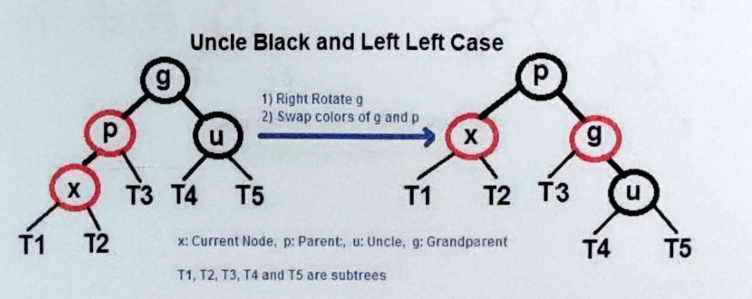
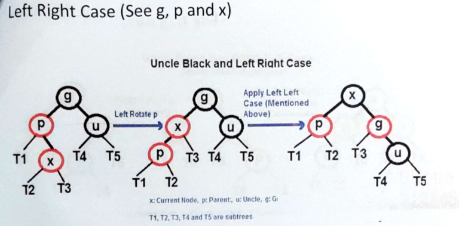
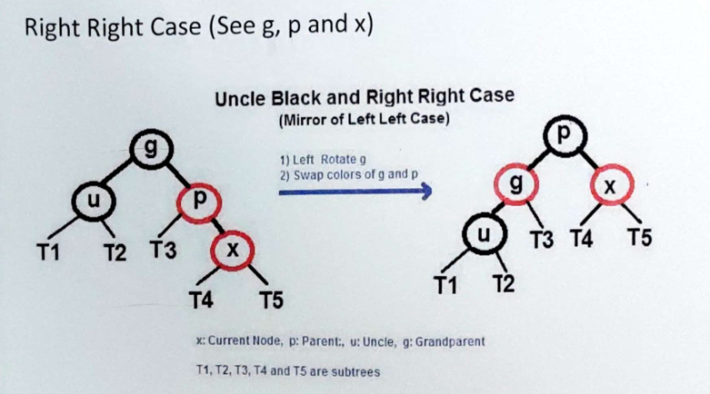
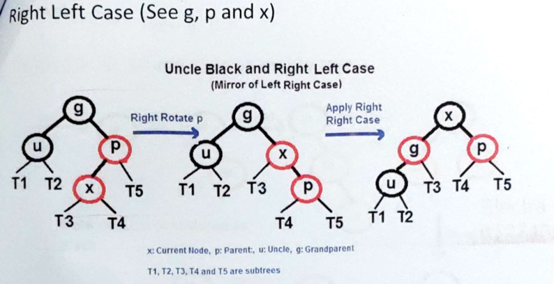
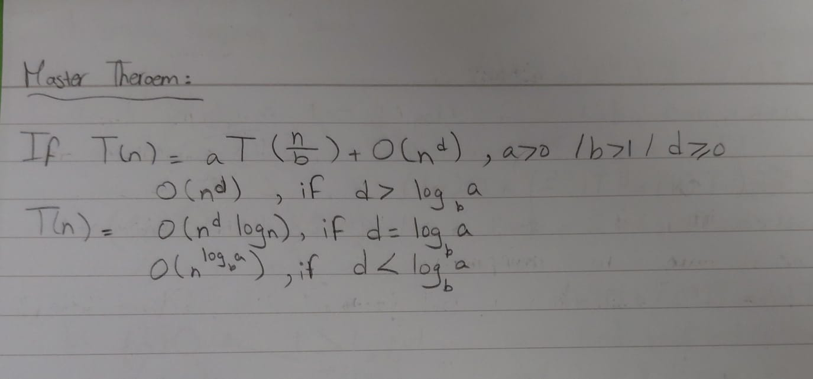

# ✅Assignment 1:
For our first assignment, we have been asked to create the following algorithms:

- Bubble sort: This sorting technique keeps comparing adjacent elements and swapping their places, resulting in the maximum or minimum element moving to the end of the list.
  
- Selection sort: In contrast with bubble sort, selection sort does not change the position of adjacent elements; however, it finds the smallest or biggest element and swaps it with the element in its correct position.

- Insertion sort: This algorithm divides the dataset into two parts — one sorted and one unsorted. During each pass, an element from the unsorted part is inserted into the sorted part until the unsorted part is empty.

What is common between these sorting algorithms is that their worst-case scenario is **O(n2)**. However, the best-case scenario occurs when the lists are already ordered, making the best-case time complexity for bubble and insertion sort **O(n)**. Due to the nature of insertion sort, fewer comparisons are made compared to the other two algorithms, making it faster for small datasets and requiring less running time.

---

# ✅Assignment 2:
Following the previous assignment, we were asked to implement other sorting algorithms that are much faster and solve a simple yet tricky problem:

- ⚓Quick sort: a divide and conquer algorithm where we pick a pivot in our list and we sort so that all the elements that are on the left of the pivot are smaller and all the elements on right are bigger and we repeat this process with different pivots.
  
- ➗Merge sort: an also a divide and conquer algorithm, which keeps recursively dividing the list on halves, sort each half separately and then merging the sorted halves.
  
- 🌲Heap sort: this sorting algorithm contains multiple steps:
  1. Building heap: a heap is a nearly complete binary tree, there can be a max or a min heap, a max heap has the largest element in its root, and every child is smaller than its parent(apply same logic to min heap).
  2. Heapify: it is the process where we place a node(element) in its correct position in the tree, this happens by comparing the node with its children and switch their positions, then apply heapify again to the same node but in its new position until it is placed in its correct place.
  3. Sorting: the sorting itself happens by removing the root, placing the last element in the root, heapify to fix the heap and repeating this process.
     
- Hybrid merge and insertion sort:

Find kth smallest: when we partition an array in quick sort we know for a fact that the pivot is in its correct position whether the list is fully sorted or not, knowing this key piece of information we will keep partitioning the array and comparing its current index with k, if they are the same we have found our kth smallest element, if not and the index of the partitioned element is less than k, we partition the righ tsub-array, and if our index is greater than k we partition the left sub-array.

---

# ✅Assignment 3:
Now we will talk about red-black trees.
Properties:
1. It is a binary seach tree.
2. Each node is either red or black.
3. If a node is red both its children are black (cant have 2 reds in a row).
4. Root is black.
5. NILS are black (nodes soon to exist).
6. All simple paths from any node x has the same number of black nodes.
7. Each node has:
   - Key (value)
   - Left
   - Right
   - Parent
   - Color
   
To balance a red-black tree we use two tool **Recoloring** and **Rotation**.
When inserting a new node we insert the new node as red and then check the uncle:
- Uncle is red:
  1. Change color of uncle and parent to black.
  2. Change color of grandparent to red.
  3. Repeat the process with the grandparent.
- Uncle is black (4 cases):
1. **Left-Left (LL)**  
   Perform a right rotation on the grandparent.  
   

2. **Left-Right (LR)**  
   Perform a left rotation on the parent, then a right rotation on the grandparent.  
   

3. **Right-Right (RR)**  
   Perform a left rotation on the grandparent.  
   

4. **Right-Left (RL)**  
   Perform a right rotation on the parent, then a left rotation on the grandparent.  
   

  

---
# ✅Assignment 4:
-Topological sort: Imagine a list of tasks, some of which depend on others to be completed first, this algorithm gives an order to perform these tasks. 
Topological sort requires a directed acyclic graph, it is a directed graph with no cycles, take for example a list of courses, to unlock later courses you need to finish the ones before it, and there is no later course that will unlock a course you have already taken making it acyclic. What topological sort does it takes the courses with 0 indegrees (the courses at the very beginning) and adds it to a queue and then remove them from the graph, after removing it we check the indegrees of the other courses, if a course's indegree becomes 0 we add it to the queue, we do this process until all the courses have an indegree of 0 or in other words until the queue becomes empty.
This process can produce multiple solutions as you can start with different vertices (courses) and take different paths.

Now to start another topic I would like to explain some shortest path finding algorithms and minimum spanning trees but before doing so I would like to define some key terms:
- Tree: undirected acyclic graph
- Spanning tree: a tree that touches all the vertices
- Minimum spanning tree: a subgraph of an undirected weighted (edges have different weights) graph such that:
  1. It is a tree
  2. Covers all the vertices
  3. Contains V-1 edges
  4. Total cost associated with tree edges is minimum among all possible spanning trees
  5. NOT NECESSARILY UNIQUE

-Prim's algorithm: imagine you want to invade a country, and you start from a city and you want to expand to different cities, you start and see which neighbouring cities you can actually invade and then pick the one with the least resources needed to invade (the least weighted edge), after invading this city you can either unlock new cities you can invade or find easier ways to invade cities you could have invaded before. That is the whole idea of prim's algorithm, we first assume that to reach any vertix it would infinity and we slowly decrease this number, this process produces a mst.

The following algorithms have not been implemented but I would like to have a brief explanation for them:

-Kruskal: with kruskal algorithm we lay out all the vertices and choose the edge with the smallest weight that also does not create a cycle which also results in a minimum spanning tree.

-Dijkstra: works similarly to prim's but when calculating the distances we add the weight of the edges to the shortest distance needed to reach the vertix we are currently on key difference is that dijkstra produces the shortest path from a source node to every node which doesnt necessarily produce an mst, it produces the shortest path to these nodes.

# Extras:
- An important way to solve recurrences is called the master theorem and here is how we use it:
  

Here is also a very useful sheet that contains the complexities of algorithms (all credit goes to kyrollosyoussef02@gmail.com):
https://docs.google.com/spreadsheets/d/1yZOz66WyuHBM2GkCr04Ozur42guU1nwmm2kIfMEvfaw/edit?gid=0#gid=0
## B-trees
- A b-tree is a self balancing tree which is mainly used for storage systems like disk based storage systems.
- Its main idea is to reduce number of disk accesses.
- An m-way tree of order m means it can have at most m children and a maximum of m-1 elements and a minimum of m/2 (except root).
